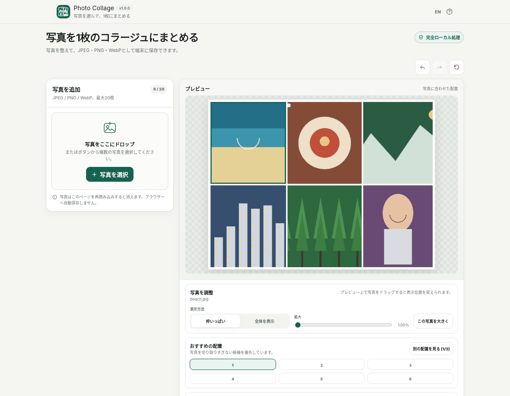
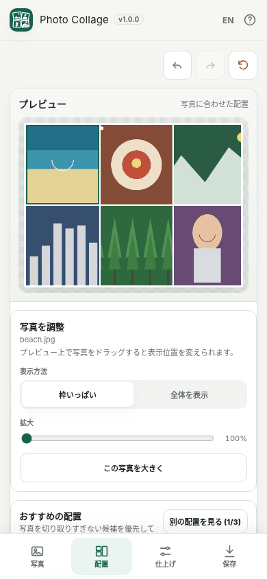

# Photo Collage / 写真コラージュ

[](https://github.com/ttomohisa/htmlapps-photo-collage/actions/workflows/deploy-pages.yml)
[](LICENSE)
[](https://ttomohisa.github.io/htmlapps-photo-collage/)

[English README](README.md)

2〜20枚のJPEG / PNG / WebP写真をブラウザー内で読み込み、写真に合った配置候補から選んで1枚のコラージュ画像として保存する単一HTMLアプリです。選択した写真をアプリから外部サーバーへアップロードせずに利用できます。

## 🚀 デモ

### [GitHub PagesでPhoto Collageを開く](https://ttomohisa.github.io/htmlapps-photo-collage/)

GitHub Pagesから最初のHTMLを読み込んだ後、写真のdecode、サムネイル生成、レイアウト計算、編集、プレビュー、書き出しは端末内で処理されます。

[](https://ttomohisa.github.io/htmlapps-photo-collage/)

## 主な機能

- **写真に合わせて配置候補を作成** — 2〜20枚の写真を追加すると、実際の縦横比を使って配置候補を作ります。白紙キャンバスから手作業で並べる必要はありません。
- **別の配置もすぐ確認** — 写真枚数に応じて追加候補がある場合は「別の配置を見る」で切り替え、その場でプレビューへ反映します。
- **写真を自然に並べ替え** — PCではDrag & Drop、タッチ端末ではドラッグハンドル、操作が難しい場合は移動ボタンを使えます。
- **写真ごとの見せ方を調整** — crop位置、1〜3倍zoom、Fill / Fit、1枚の「この写真を大きく」に対応します。
- **キャンバスを短時間で仕上げ** — 初期値4:3のほか、1:1 / 4:5 / 9:16 / 16:9 / 3:2 / 4:3 / custom比率、写真間隔、外周余白、背景、透明背景、角丸を調整できます。
- **元写真から書き出し** — JPEG / PNG / WebP、長辺1080 / 2160 / 4096px / custom解像度に対応します。
- **Undo / Redo** — 並べ替え、配置、crop、仕上げ、保存設定などを最大50操作まで戻せます。
- **PC / スマートフォン対応** — スマホでは「写真 / 配置 / 仕上げ / 保存」の4画面に分けて操作します。
- **完全ローカル処理** — アカウント、runtime CDN、remote font、Analytics、Telemetry、外部APIを必要としません。

## すぐに使う

### Webで使う

[デモを開く](https://ttomohisa.github.io/htmlapps-photo-collage/)だけで利用できます。インストールやアカウント登録は不要です。

### 単一HTMLをダウンロードして使う

1. [photo-collage.html](https://github.com/ttomohisa/htmlapps-photo-collage/blob/main/photo-collage.html) をダウンロードします。
2. 最新のChrome / Edge / Firefox / Safariで開きます。
3. 写真を追加して、完成したコラージュを端末へ保存します。

### ビルドして使う

1. このリポジトリをダウンロードまたはcloneします。
2. Windowsで `build-standalone.bat` を実行します。
3. 以下が生成されます。
   - `dist/index.html` — 読みやすい自己完結HTML
   - `dist/index.self-extract.html` — gzip自己展開型単一HTML
   - `photo-collage.html` — repository rootの読みやすいcopy
4. 必要なHTMLを任意の場所へコピーして利用します。

アプリを使うだけならPython、Node.js、ローカルWebサーバー、デスクトップアプリのインストールは不要です。

## 使い方

1. JPEG / PNG / WebP写真を2〜20枚、ファイル選択またはDrag & Dropで追加します。
2. 「おすすめの配置」から1つ選びます。追加候補がある場合は「別の配置を見る」で切り替えます。
3. 必要に応じて写真を並べ替えます。
4. 写真を選択し、crop位置、zoom、Fill / Fit、「この写真を大きく」を調整します。
5. キャンバス比率、写真間隔、外周余白、背景、透明背景、角丸を調整します。
6. JPEG / PNG / WebP、解像度、画質を選びます。
7. 必要ならファイル名を変更し、「画像を保存」を押します。

写真の読み込み中は「読み込みをキャンセル」で中止できます。追加済みの写真・編集内容・元に戻す／やり直す履歴は維持します。再選択すると前の読み込みを中止し、新しく選んだ写真だけを追加します。対応外・破損したファイルは全件失敗した場合も名前を表示し、同じ一組で読み込めた写真は追加します。キャンセルや全件失敗では直前の書き出し結果表示も保持します。

キャンバス比率の初期値は **4:3** です。透明背景はPNGで利用できます。

### キーボード操作

| ショートカット | 操作 |
| --- | --- |
| `Ctrl` / `⌘` + `Z` | 元に戻す |
| `Ctrl` / `⌘` + `Shift` + `Z` | やり直す |
| `Ctrl` + `Y` | やり直す |
| プレビューにfocusして `←` / `→` / `↑` / `↓` | 選択中のFill写真を位置調整 |
| `Shift` + 矢印キー | 大きく位置調整 |
| `Esc` | 開いているdialogを閉じる |

## スマートフォンでの操作

狭い画面では下部固定バーから4画面を切り替えます。

- **写真** — 写真の追加、確認、並べ替え、削除。
- **配置** — レイアウト選択と写真ごとの位置・拡大調整。
- **仕上げ** — 比率、余白、背景、透明背景、角丸。
- **保存** — 形式、解像度、画質、ファイル名を選んで保存。

写真が2枚になるまでは「配置 / 仕上げ / 保存」は無効です。

[](https://ttomohisa.github.io/htmlapps-photo-collage/)

## GitHub Pagesで公開する

このリポジトリには、正式版regressionを実行し、単一HTMLをbuildして `dist/` をGitHub Pagesへ公開するworkflowが含まれています。

1. **Settings → Pages → Build and deployment → Source** で **GitHub Actions** を選択します。
2. `main` へpushするか、Actionsから **Deploy standalone app to GitHub Pages** を実行します。
3. 成功後、`https://ttomohisa.github.io/htmlapps-photo-collage/` で利用できます。

## 開発とビルド

```text
.
├─ src/index.template.html                 # アプリ本体
├─ assets/favicon.svg                      # favicon / 左上アイコンの正
├─ assets/screenshot.png                   # 日本語 desktop
├─ assets/screenshot-en.png                # English desktop
├─ assets/screenshot-mobile.png            # 日本語 smartphone
├─ assets/screenshot-mobile-en.png         # English smartphone
├─ scripts/check-photo-collage-release.cjs # 正式版regression
├─ build-standalone.bat                     # Windows build入口
├─ build-standalone.ps1                     # 単一HTML build
├─ dist/index.html                          # 読みやすい生成物
├─ dist/index.self-extract.html             # 自己展開型生成物
└─ .github/workflows/
   ├─ build-standalone.yml                  # Pull Request検証
   └─ deploy-pages.yml                      # GitHub Pages公開
```

Windowsで正式版確認を行う場合：

```powershell
node .\scripts\check-photo-collage-release.cjs
powershell.exe -NoLogo -NoProfile -ExecutionPolicy Bypass -File .\scripts\check-powershell-syntax.ps1
powershell.exe -NoLogo -NoProfile -ExecutionPolicy Bypass -File .\scripts\check-repository.ps1
```

## プライバシーと外部通信

選択した写真と編集状態はブラウザーセッション内で処理します。

- Runtime Content Security Policyは `connect-src 'none'`。
- runtime CDN、remote font、Analytics、Telemetry、外部APIはありません。
- 選択した写真をアプリから外部サーバーへアップロードしません。
- 写真や編集状態をlocalStorage / IndexedDB / Cache Storageへ自動保存しません。
- 出力画像はCanvasから新しくencodeし、元写真のEXIF、GPS、カメラ情報、元ファイル名を意図的にコピーしません。

GitHub Pages版では最初のHTML配信は発生します。ネットワークを切って利用する場合は、生成済みの単一HTMLをローカルで開いてください。

## 制限事項

- 1コラージュ2〜20枚。
- 入力はJPEG / PNG / WebP。HEIC / HEIFはv1.0.0正式対応外。
- テキスト、ステッカー、フィルター、背景除去、完全自由配置、自由角度回転、クラウド保存、共同編集は対象外。
- custom canvas ratioは1:10〜10:1。
- 書き出しは最大辺8192px / 最大32MP。
- PNGは透明背景に対応。JPEGは現在の背景色へflattenします。
- WebP書き出しはブラウザーがCanvas WebP encodeへ対応している場合のみ利用可能です。
- 非常に大きな元写真はブラウザーや端末の画像処理メモリ上限へ達する場合があります。写真は逐次処理し、resource不足を検出した場合は回復案内を表示します。
- 再読み込みやタブを閉じると現在の写真と編集内容は失われます。

## 使用ライブラリ

Photo Collageは現時点で**third-party runtime libraryを内包していません**。File / Blob / Canvas 2D / Pointer Events / image decoding APIなど、ブラウザー標準APIを利用しています。

詳細は [THIRD_PARTY_NOTICES.md](THIRD_PARTY_NOTICES.md) を確認してください。

## コントリビューション

バグ報告や機能提案はIssueからお願いします。開発への参加方法は [CONTRIBUTING.md](CONTRIBUTING.md) を確認してください。

## ライセンス

Copyright © 2026 ttomohisa

このプロジェクトは [MIT License](LICENSE) で公開されています。
