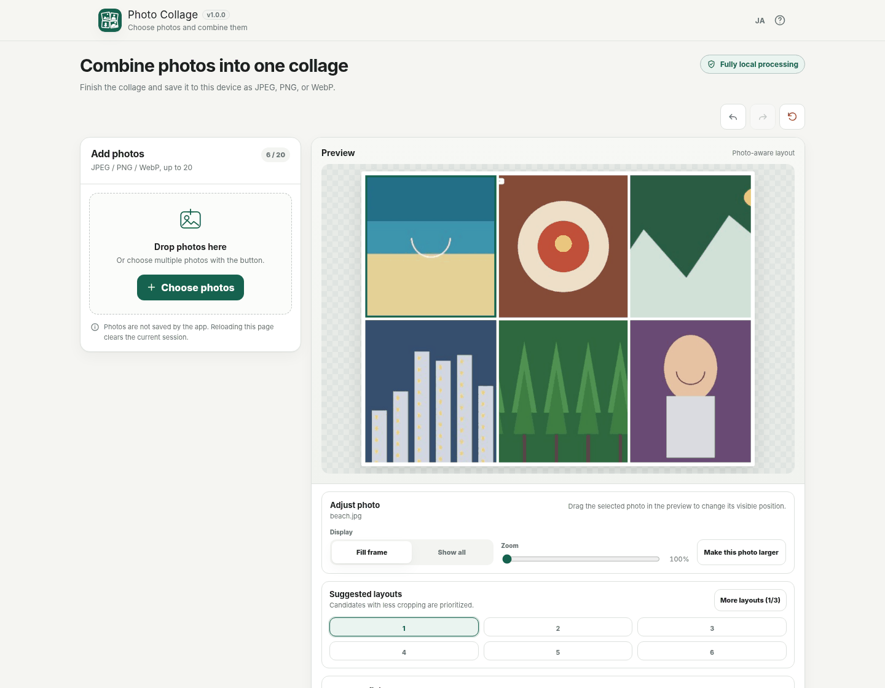
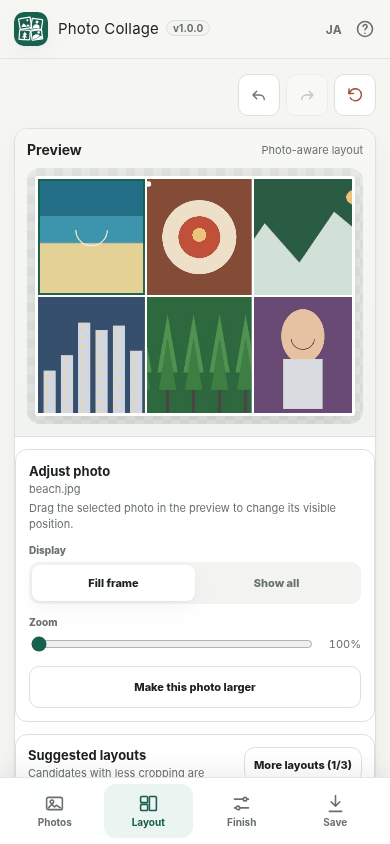

# Photo Collage

[](https://github.com/ttomohisa/htmlapps-photo-collage/actions/workflows/deploy-pages.yml)
[](LICENSE)
[](https://ttomohisa.github.io/htmlapps-photo-collage/)

[日本語版 README](README.ja.md)

A privacy-focused, single-HTML photo collage app that combines 2–20 JPEG, PNG, or WebP images directly in the browser. It suggests layouts based on the photos, lets you adjust the result, and exports JPEG, PNG, or WebP without uploading selected photos to an application server.

## 🚀 Live demo

### [Open Photo Collage on GitHub Pages](https://ttomohisa.github.io/htmlapps-photo-collage/)

GitHub Pages delivers the initial HTML. After it loads, photo decoding, thumbnail generation, layout calculation, editing, preview, and export are processed locally on your device.

[](https://ttomohisa.github.io/htmlapps-photo-collage/)

## Features

- **Photo-aware layout suggestions** — Add 2–20 photos and choose from layouts scored against the actual photo aspect ratios instead of starting from a blank canvas.
- **More layouts when you want another arrangement** — Additional candidate pages are available for larger photo sets, and switching pages immediately updates the preview.
- **Reorder photos naturally** — Use desktop Drag & Drop, a touch-friendly drag handle, or the move buttons.
- **Adjust each photo without a free-form editor** — Change crop position, 1×–3× zoom, Fill / Fit, or mark one photo as the featured image.
- **Finish the canvas quickly** — Start at 4:3 or choose 1:1, 4:5, 9:16, 16:9, 3:2, 4:3, or a custom ratio, then adjust spacing, outer margin, background, transparency, and rounded corners.
- **Export from the original photos** — Save as JPEG, PNG, or WebP at 1080, 2160, 4096px, or a custom long-side size.
- **Undo and redo safely** — Keep up to 50 edit steps, including reorder, layout, crop, finish settings, and export settings.
- **Desktop and smartphone workflows** — Smartphones use dedicated Photos / Layout / Finish / Save pages instead of a long stacked desktop UI.
- **Fully local processing** — No account, runtime CDN, remote font, analytics, telemetry, or external API is required by the app.

## Quick start

### Use the web demo

Just [open the demo](https://ttomohisa.github.io/htmlapps-photo-collage/). No installation or account is required.

### Use the downloadable single HTML

1. Download [photo-collage.html](https://github.com/ttomohisa/htmlapps-photo-collage/blob/main/photo-collage.html).
2. Open it in a current Chrome, Edge, Firefox, or Safari.
3. Add your photos and save the finished collage locally.

### Build the standalone files

1. Download or clone this repository.
2. On Windows, run `build-standalone.bat`.
3. The build creates:
   - `dist/index.html` — readable self-contained HTML
   - `dist/index.self-extract.html` — gzip self-extracting single HTML
   - `photo-collage.html` — readable root copy
4. Copy the generated HTML wherever you want to use it.

The app itself does not require Python, Node.js, a local web server, or an installed desktop application.

## Usage

1. Add 2–20 JPEG, PNG, or WebP photos with the file picker or Drag & Drop.
2. Choose a suggested layout. When more candidate pages are available, use **More layouts**.
3. Reorder photos as needed.
4. Select a photo to adjust crop position, zoom, Fill / Fit, or featured-photo status.
5. Adjust the canvas ratio, photo spacing, outer margin, background, transparency, and rounded corners.
6. Choose JPEG, PNG, or WebP, then set the output resolution and quality.
7. Edit the output filename if needed and select **Save image**.

The default canvas ratio is **4:3**. Transparent background is available for PNG export.

### Keyboard shortcuts

| Shortcut | Action |
| --- | --- |
| `Ctrl` / `⌘` + `Z` | Undo |
| `Ctrl` / `⌘` + `Shift` + `Z` | Redo |
| `Ctrl` + `Y` | Redo |
| `←` / `→` / `↑` / `↓` on the focused preview | Reposition the selected Fill photo |
| `Shift` + arrow key | Reposition the selected photo by a larger step |
| `Esc` | Close an open dialog |

## Smartphone workflow

On narrow smartphone layouts, the fixed bottom bar separates the workflow into four pages:

- **Photos** — add, review, reorder, and remove photos.
- **Layout** — choose a layout and adjust individual photos.
- **Finish** — adjust ratio, spacing, background, transparency, and corners.
- **Save** — choose export settings and save the result.

Layout, Finish, and Save stay disabled until at least two photos are ready.

[](https://ttomohisa.github.io/htmlapps-photo-collage/)

## Publish with GitHub Pages

This repository includes a workflow that validates the stable-release regression, builds the standalone HTML, and deploys `dist/` to GitHub Pages.

1. Open **Settings → Pages → Build and deployment → Source** and select **GitHub Actions**.
2. Push to `main`, or run **Deploy standalone app to GitHub Pages** from the Actions tab.
3. After a successful deployment, the app is available at `https://ttomohisa.github.io/htmlapps-photo-collage/`.

## Development and build layout

```text
.
├─ src/index.template.html                 # Application source
├─ assets/favicon.svg                      # Canonical favicon + header icon
├─ assets/screenshot.png                   # Japanese desktop screenshot
├─ assets/screenshot-en.png                # English desktop screenshot
├─ assets/screenshot-mobile.png            # Japanese smartphone screenshot
├─ assets/screenshot-mobile-en.png         # English smartphone screenshot
├─ scripts/check-photo-collage-release.cjs # Stable release regression
├─ build-standalone.bat                     # Windows build entry point
├─ build-standalone.ps1                     # Standalone HTML builder
├─ dist/index.html                          # Readable generated app
├─ dist/index.self-extract.html             # Self-extracting generated app
└─ .github/workflows/
   ├─ build-standalone.yml                  # Pull request validation
   └─ deploy-pages.yml                      # GitHub Pages deployment
```

For a full release check on Windows:

```powershell
node .\scripts\check-photo-collage-release.cjs
powershell.exe -NoLogo -NoProfile -ExecutionPolicy Bypass -File .\scripts\check-powershell-syntax.ps1
powershell.exe -NoLogo -NoProfile -ExecutionPolicy Bypass -File .\scripts\check-repository.ps1
```

## Privacy and runtime network protection

The generated application keeps selected photos and edit state in the browser session.

- The runtime Content Security Policy contains `connect-src 'none'`.
- There is no runtime CDN, remote font, analytics, telemetry, or external API.
- Selected photos are not uploaded by the app.
- Photos and edit state are not automatically persisted to localStorage, IndexedDB, or Cache Storage.
- Exported images are newly encoded from Canvas. Source EXIF, GPS, camera metadata, and original filenames are not intentionally copied into the exported image.

The GitHub Pages version still needs the initial HTML request. To use the app with the network disconnected, open the generated standalone HTML locally.

## Limitations

- 2–20 photos per collage.
- Input: JPEG, PNG, and WebP. HEIC / HEIF is not officially supported in v1.0.0.
- No text, stickers, filters, background removal, free placement, arbitrary-angle rotation, cloud project storage, or collaboration.
- Custom canvas ratios are limited to 1:10 through 10:1.
- Export is limited to 8192px on either edge and 32MP total.
- PNG supports transparent background. JPEG is flattened to the selected background color.
- WebP export is available only when the browser supports Canvas WebP encoding.
- Very large source photos can exceed browser or device memory. The app processes photos sequentially and shows a recovery suggestion when resource pressure is detected.
- Reloading or closing the page clears the current photos and edits.

## Dependencies

Photo Collage currently bundles **no third-party runtime library code**. It uses browser-native APIs including File, Blob, Canvas 2D, Pointer Events, and image decoding APIs.

See [THIRD_PARTY_NOTICES.md](THIRD_PARTY_NOTICES.md) for the current notice policy.

## Contributing

Bug reports and feature proposals are welcome through GitHub Issues. See [CONTRIBUTING.md](CONTRIBUTING.md) for development guidance.

## License

Copyright © 2026 ttomohisa

Licensed under the [MIT License](LICENSE).
